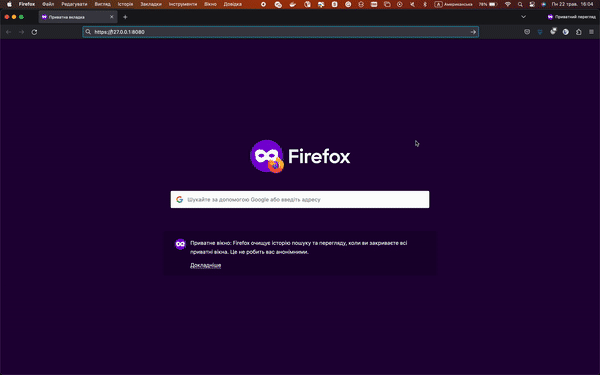

# AsciiArtify PoC (Proof of Concept) deploying GitOps with Argo CD on the Kubernetes cluster

## Before deployment

* installed minikube
* created kubernetes cluster minikube

## Install Argo CD stable version

```bash
kubectl create namespace argocd
kubectl apply -n argocd -f https://raw.githubusercontent.com/argoproj/argo-cd/stable/manifests/install.yaml
```
This default installation will have a self-signed certificate and cannot be accessed without a bit of extra work. Use the --insecure flag on all Argo CD CLI operations in this guide.

## Install Argo CD CLI

```bash
brew install argocd
```

## Configure CLI access

CLI login in Argo CD
```bash
argocd login --core
```

Set argocd context for kubectl
```bash
kubectl config set-context --current --namespace=argocd
```

Show admin initial password
```bash
argocd admin initial-password -n argocd
```

Forward service socket on local machine to access the Argo CD web UI
```bash
kubectl port-forward svc/argocd-server -n argocd 8080:443
```

### CLI installation


### Web UI access

